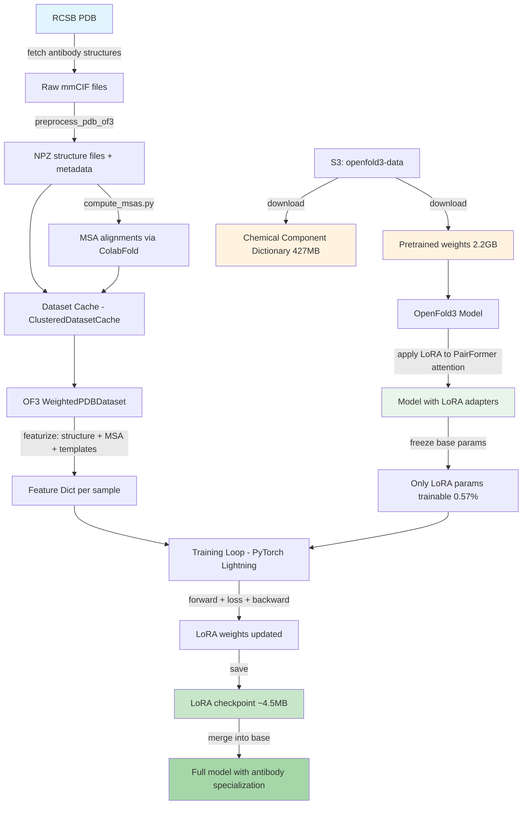
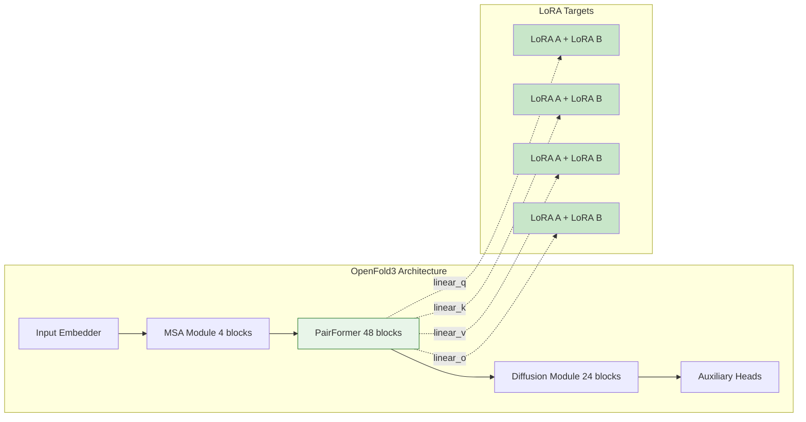

# FoldFit: LoRA Fine-Tuning of OpenFold3 for Antibody Structure Prediction

Parameter-efficient fine-tuning of [OpenFold3](https://github.com/aqlaboratory/openfold) using **LoRA (Low-Rank Adaptation)** on antibody structures from the RCSB PDB. The goal is to improve structure prediction accuracy in the antibody domain without retraining the full 368M-parameter model.

## Overview



## Prerequisites

### 1. Clone and set up OpenFold3

```bash
git clone https://github.com/aqlaboratory/openfold.git openfold-3
cd openfold-3
pip install -e .
cd ..
```

### 2. Download pretrained model weights

The OpenFold3 pretrained checkpoint (~2.2 GB) is hosted on a public AWS S3 bucket (no credentials required):

```bash
mkdir -p ~/.openfold3
aws s3 cp s3://openfold3-data/openfold3-parameters/of3-p2-155k.pt \
    ~/.openfold3/of3-p2-155k.pt --no-sign-request
```

### 3. Download the Chemical Component Dictionary (CCD)

The CCD (~427 MB) is required for structure preprocessing. It defines the chemical components (amino acids, ligands, etc.) used in PDB structures:

```bash
aws s3 cp s3://openfold3-data/chemical_component_dictionary.cif \
    ~/.openfold3/chemical_component_dictionary.cif --no-sign-request
```

### 4. Install Python dependencies

```bash
pip install torch pytorch-lightning ml_collections biotite pdbeccdutils \
    gemmi lmdb memory_profiler func_timeout kalign-python click pyyaml \
    pydantic requests boto3 awscli numpy scipy rdkit
```

## Pipeline Steps

The fine-tuning pipeline consists of four stages: **data preparation**, **MSA computation**, **dataset cache creation**, and **LoRA training**.

---

### Step 1: Fetch and Preprocess Antibody Structures

This step downloads antibody mmCIF files from the RCSB PDB, then preprocesses them into the NPZ format that OpenFold3 expects. Preprocessing includes:

- Parsing mmCIF files with biotite
- Removing water molecules, hydrogen atoms, and crystallization aids
- Detecting and removing inter-chain disulfide bonds
- Adding unresolved residue segments
- Extracting reference molecule conformers (SDF files)
- Generating FASTA sequence files
- Writing structure metadata cache

```bash
PYTHONPATH="$PWD:$PWD/openfold-3" python -m finetuning.scripts.prepare_antibody_data \
    --output-dir ./data/antibody_training \
    --ccd-path ~/.openfold3/chemical_component_dictionary.cif \
    --max-structures 100 \
    --max-resolution 3.0 \
    --num-workers 0
```

**Outputs:**
```
data/antibody_training/
├── raw_cif/                          # Downloaded mmCIF files
├── preprocessed/
│   ├── structure_files/{pdb_id}/     # NPZ + FASTA per structure
│   ├── reference_mols/               # SDF conformer files
│   └── metadata.json                 # Preprocessing metadata
├── dataset_cache.json                # ClusteredDatasetCache for OF3
└── pdb_ids.txt                       # List of PDB IDs used
```

> **Note:** If `--num-workers > 0`, the CCD must be loaded into each worker, which takes ~15-20 minutes for the full 427 MB file. Use `--num-workers 0` for small datasets to avoid this overhead.

You can also provide an explicit list of PDB IDs instead of searching RCSB:

```bash
# Create a file with one PDB ID per line
echo -e "7FAE\n1IGT\n6RYG" > my_antibodies.txt

PYTHONPATH="$PWD:$PWD/openfold-3" python -m finetuning.scripts.prepare_antibody_data \
    --output-dir ./data/antibody_training \
    --ccd-path ~/.openfold3/chemical_component_dictionary.cif \
    --pdb-ids-file my_antibodies.txt \
    --num-workers 0 \
    --skip-download   # if mmCIF files are already in raw_cif/
```

---

### Step 2: Compute MSAs via ColabFold

Multiple Sequence Alignments (MSAs) provide evolutionary context that is critical for structure prediction. This step queries the free [ColabFold MSA server](https://api.colabfold.com) to generate MSAs for each protein chain:

```bash
PYTHONPATH="$PWD:$PWD/openfold-3" python -m finetuning.scripts.compute_msas \
    --data-dir ./data/antibody_training \
    --user-agent "openfold3-antibody-lora"
```

**What it does:**
1. Reads FASTA sequences from preprocessed structures
2. Queries ColabFold API (`https://api.colabfold.com`) for each unique protein sequence
3. Downloads MSA results in a3m format
4. Deduplicates identical sequences across chains (reuses MSAs)
5. Fixes sequence length mismatches (ColabFold sometimes returns MSAs with off-by-one lengths)
6. Saves MSA files as `colabfold_main.a3m` (filename must match OpenFold3's `max_seq_counts` filter)

**Outputs:**
```
data/antibody_training/
├── msas/{pdb_id}/                    # Raw a3m files per chain
└── alignments/{pdb_id}_{chain_id}/   # Renamed for OF3 compatibility
    └── colabfold_main.a3m            # Must be named colabfold_main.a3m
```

> **Important:** OpenFold3 filters MSA files by filename. The file MUST be named `colabfold_main.a3m` (not `main.a3m` or anything else), otherwise the MSA is silently discarded and training fails with empty alignments.

> **Rate limiting:** The script pauses every 5 queries to respect the free ColabFold API. For 100 antibodies with ~2 unique chains each, expect ~30 minutes.

---

### Step 3: Dataset Cache

The `prepare_antibody_data.py` script automatically creates a `dataset_cache.json` in the `ClusteredDatasetCache` format that OpenFold3's `WeightedPDBDataset` expects. This cache contains:

- Per-structure metadata: chains, resolution, release date
- Per-chain metadata: molecule type, alignment representative ID, cluster info
- Interface definitions (pairs of protein chains)
- Reference molecule metadata

Key details:
- **`alignment_representative_id`** must be `"{pdb_id}_{chain_id}"` and match the directory name under `alignments/`
- Non-protein chains (ligands, ions) must have `alignment_representative_id: null`
- Each chain needs `cluster_id` and `cluster_size` for the weighted sampling

---

### Step 4: LoRA Training

```bash
PYTHONPATH="$PWD:$PWD/openfold-3" python -m finetuning.scripts.train_lora \
    --dataset-cache ./data/antibody_training/dataset_cache.json \
    --structure-dir ./data/antibody_training/preprocessed/structure_files \
    --reference-mol-dir ./data/antibody_training/preprocessed/reference_mols \
    --alignment-dir ./data/antibody_training/alignments \
    --checkpoint ~/.openfold3/of3-p2-155k.pt \
    --output-dir ./output/lora_antibody \
    --max-epochs 10 \
    --token-budget 48 \
    --lr 5e-5
```

#### How LoRA works in this pipeline



1. **Load pretrained model** (368M parameters)
2. **Apply LoRA** to attention projection layers (`linear_q`, `linear_k`, `linear_v`, `linear_o`) in all 48 PairFormer blocks, adding 624 LoRA adapter pairs
3. **Freeze all base parameters** - only LoRA parameters are trainable (2.1M params, 0.57% of total)
4. **LoRA initialization**: `lora_A` with Kaiming uniform, `lora_B` with zeros, so the adapter starts as identity (zero delta)
5. **Forward pass** through the full model using OpenFold3's native pipeline
6. **Loss computation** using OpenFold3's loss module (diffusion loss + confidence loss + distogram loss)
7. **Backward pass** - gradients flow only through LoRA parameters
8. **EMA** tracking of LoRA parameters for stable validation

#### Training hyperparameters

| Parameter | Default | Description |
|-----------|---------|-------------|
| `--lora-rank` | 8 | Rank of LoRA decomposition. Higher = more capacity but more parameters |
| `--lora-alpha` | 16.0 | Scaling factor. Effective scaling = alpha/rank |
| `--lr` | 5e-5 | Learning rate for AdamW optimizer |
| `--token-budget` | 48 | Max tokens per crop. **Critical for memory** |
| `--max-epochs` | 10 | Number of training epochs |

#### Token budget and memory

The `--token-budget` controls how many residue tokens are used per training sample. This is the main lever for controlling GPU memory usage:

| Token Budget | ~VRAM Usage | Notes |
|-------------|-------------|-------|
| 32 | ~8 GB | Very small crops, fast but limited context |
| 48 | ~14 GB | Minimum for meaningful training |
| 128 | ~28 GB | Good balance for A100/H100 |
| 256 | ~50 GB | Requires A100 80GB |
| 384 | ~70 GB | Requires H100 80GB |
| 640 | ~140 GB | Multi-GPU or model parallelism needed |

> **For SLURM clusters with A100/H100 GPUs**, use `--token-budget 256` or higher. The model needs larger crops to learn meaningful structural patterns. Token budget 48 is only for testing on consumer GPUs.

#### Output

```
output/lora_antibody/
├── checkpoints/
│   ├── last.ckpt              # Full Lightning checkpoint
│   └── epoch=X-step=Y.ckpt   # Periodic checkpoints
├── lora_final.pt              # LoRA-only weights (~4.5 MB)
└── lightning_logs/
    └── version_0/metrics.csv  # Training metrics
```

---

## SLURM Example

```bash
#!/bin/bash
#SBATCH --job-name=foldfit-lora
#SBATCH --partition=gpu
#SBATCH --gres=gpu:a100:1
#SBATCH --cpus-per-task=8
#SBATCH --mem=64G
#SBATCH --time=24:00:00
#SBATCH --output=logs/foldfit_%j.out

module load cuda/12.1

export PYTHONPATH="$PWD:$PWD/openfold-3"

# Step 1: Preprocess (only needed once)
python -m finetuning.scripts.prepare_antibody_data \
    --output-dir ./data/antibody_training \
    --ccd-path ~/.openfold3/chemical_component_dictionary.cif \
    --max-structures 500 \
    --max-resolution 3.0 \
    --num-workers 0

# Step 2: Compute MSAs (only needed once)
python -m finetuning.scripts.compute_msas \
    --data-dir ./data/antibody_training

# Step 3: Train with LoRA
python -m finetuning.scripts.train_lora \
    --dataset-cache ./data/antibody_training/dataset_cache.json \
    --structure-dir ./data/antibody_training/preprocessed/structure_files \
    --reference-mol-dir ./data/antibody_training/preprocessed/reference_mols \
    --alignment-dir ./data/antibody_training/alignments \
    --checkpoint ~/.openfold3/of3-p2-155k.pt \
    --output-dir ./output/lora_antibody \
    --max-epochs 50 \
    --token-budget 256 \
    --lr 5e-5 \
    --lora-rank 8
```

## Merging LoRA Weights

After training, you can merge the LoRA weights back into the base model to produce a full checkpoint that doesn't require the LoRA code at inference time:

```python
from finetuning.lora.applicator import LoRAApplicator
from finetuning.lora.checkpoint import LoRACheckpointManager
from finetuning.lora.config import LoRAConfig

# 1. Build model and apply LoRA
model = OpenFold3(model_config)
model.load_state_dict(base_weights)

config = LoRAConfig(rank=8, alpha=16.0, ...)
LoRAApplicator(config).apply(model)

# 2. Load trained LoRA weights
LoRACheckpointManager.load_lora_weights(model, "output/lora_antibody/lora_final.pt")

# 3. Merge into base model and save
LoRACheckpointManager.merge_and_save(model, "merged_antibody_model.pt")
```

## Unit Tests

The core LoRA module has 57 unit tests that can run without GPU or OpenFold3:

```bash
PYTHONPATH="$PWD" python -m pytest finetuning/tests/ -v
```

## Project Structure

```
finetuning/
├── lora/                    # Core LoRA implementation
│   ├── config.py            # LoRAConfig dataclass
│   ├── layers.py            # LoRALinear wrapper module
│   ├── applicator.py        # Applies LoRA to model via module tree traversal
│   └── checkpoint.py        # Save/load/merge LoRA-only weights
├── runner/                  # Training infrastructure
│   ├── lora_runner.py       # PyTorch Lightning module
│   └── lora_ema.py          # EMA tracking only LoRA parameters
├── scripts/                 # End-to-end pipeline scripts
│   ├── prepare_antibody_data.py  # Preprocessing pipeline
│   ├── compute_msas.py           # ColabFold MSA computation
│   └── train_lora.py             # Training script
├── data/                    # Data utilities
│   ├── antibody_fetcher.py  # RCSB PDB search and download
│   ├── cdr_annotator.py     # CDR region annotation
│   └── filters.py           # Structure filtering strategies
├── evaluation/              # Evaluation metrics
│   ├── metrics.py           # RMSD, dRMSD, CDR-RMSD, interface contacts
│   └── evaluate.py          # Evaluation entry point
├── config/                  # Configuration
│   ├── finetune_config.py   # Pydantic config schema
│   └── default_antibody.yml # Default training config
├── cli.py                   # Click CLI entry point
└── tests/                   # 57 unit tests
```

## Troubleshooting

| Issue | Solution |
|-------|----------|
| `ModuleNotFoundError: No module named 'openfold3'` | Set `PYTHONPATH="$PWD:$PWD/openfold-3"` |
| OOM during training | Reduce `--token-budget` (try 48 for 16GB, 128 for 40GB, 256 for 80GB) |
| MSA files silently ignored | Ensure MSA files are named `colabfold_main.a3m`, not `main.a3m` |
| `IndexError: list index out of range` in MSA parsing | Check a3m files have consistent sequence lengths after removing lowercase insertions |
| `KeyError: 'ClusteredDatasetCache'` | Regenerate dataset cache with `_type: ClusteredDatasetCache` |
| CUTLASS warnings | Install `nvidia-cutlass` or ignore (training works without it) |
| Permutation alignment errors | These are caught and handled by fallback; training continues |
