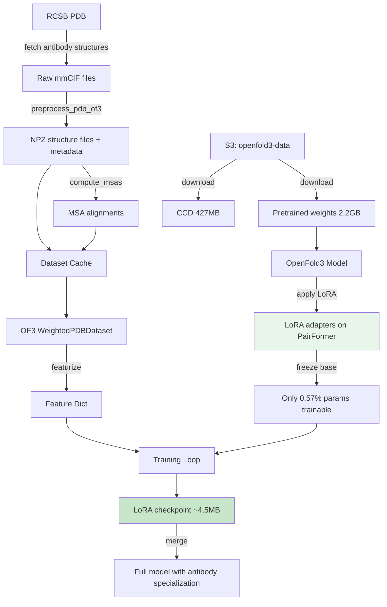
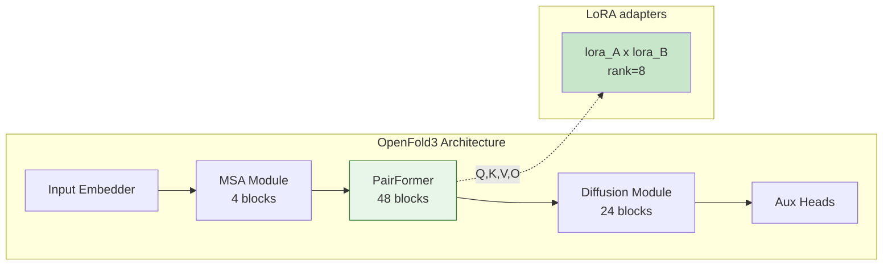

# FoldFit: LoRA Fine-Tuning of OpenFold3 for Antibody Structure Prediction

Parameter-efficient fine-tuning of [OpenFold3](https://github.com/aqlaboratory/openfold) using **LoRA (Low-Rank Adaptation)** on antibody structures from the RCSB PDB. The goal is to improve structure prediction accuracy in the antibody domain without retraining the full 368M-parameter model.

## Overview



## Quick Start

```bash
# 1. Set up environment
pip install torch pytorch-lightning typer pyyaml ml_collections biotite \
    pdbeccdutils gemmi lmdb memory_profiler func_timeout requests

# 2. Download pretrained weights + CCD
mkdir -p ~/.openfold3
aws s3 cp s3://openfold3-data/openfold3-parameters/of3-p2-155k.pt ~/.openfold3/ --no-sign-request
aws s3 cp s3://openfold3-data/chemical_component_dictionary.cif ~/.openfold3/ --no-sign-request

# 3. Edit config.yaml with your paths (databases, checkpoint, etc.)

# 4. Run the full pipeline
PYTHONPATH="$PWD/..:$PWD/../openfold-3"

# Step 1: Preprocess antibody structures
python -m finetuning.scripts.prepare_antibody_data --config config.yaml

# Step 2: Compute MSAs
python -m finetuning.scripts.compute_msas --config config.yaml

# Step 3: Train with LoRA
python -m finetuning.scripts.train_lora --config config.yaml
```

## Configuration

All settings are in **`config.yaml`**. Edit this file before running any step.

```yaml
# Key sections:
paths:
  checkpoint: ~/.openfold3/of3-p2-155k.pt
  ccd: ~/.openfold3/chemical_component_dictionary.cif
  data_dir: ./data/antibody_training

msa:
  method: mmseqs  # "mmseqs" | "jackhmmer" | "colabfold"

lora:
  rank: 8
  alpha: 16.0
  target_modules: [linear_q, linear_k, linear_v, linear_o]
  target_blocks: [pairformer_stack]

training:
  token_budget: 256  # controls VRAM usage
  max_epochs: 50
  learning_rate: 5.0e-5
```

See the full [config.yaml](config.yaml) for all options.

---

## Pipeline Steps

### Step 1: Fetch and Preprocess Antibody Structures

Downloads antibody mmCIF files from RCSB PDB and preprocesses them into the NPZ format that OpenFold3 expects (tokenization, bond detection, conformer extraction, etc.).

```bash
python -m finetuning.scripts.prepare_antibody_data \
    --config config.yaml \
    --output-dir ./data/antibody_training \
    --ccd-path ~/.openfold3/chemical_component_dictionary.cif \
    --max-structures 100
```

Or with a custom PDB ID list:

```bash
echo -e "7FAE\n1IGT\n6RYG" > my_antibodies.txt
python -m finetuning.scripts.prepare_antibody_data \
    --config config.yaml \
    --pdb-ids-file my_antibodies.txt \
    --skip-download  # if mmCIF files already exist
```

**Outputs:**
```
data/antibody_training/
├── raw_cif/                          # Downloaded mmCIF files
├── preprocessed/
│   ├── structure_files/{pdb_id}/     # NPZ + FASTA per structure
│   ├── reference_mols/               # SDF conformer files
│   └── metadata.json                 # Preprocessing metadata
└── dataset_cache.json                # ClusteredDatasetCache for OF3
```

---

### Step 2: Compute MSAs

Computes Multiple Sequence Alignments for each protein chain. Three methods are available:

| Method | Speed | Quality | Requirements |
|--------|-------|---------|-------------|
| **mmseqs** | Fast (~5s/query) | Good | Local MMseqs2 + sequence DB |
| **jackhmmer** | Slow (~minutes/query) | Best | Local HMMER + FASTA DBs |
| **colabfold** | Medium (~30s/query) | Good | Internet connection only |

Set the method in `config.yaml`:

```yaml
msa:
  method: mmseqs  # or "jackhmmer" or "colabfold"
```

Then run:

```bash
python -m finetuning.scripts.compute_msas --config config.yaml
```

#### MMseqs2 (recommended for clusters with local databases)

Requires MMseqs2 binary and a sequence database (e.g., SwissProt, UniRef90):

```yaml
msa:
  method: mmseqs
  mmseqs:
    binary_path: /path/to/mmseqs
    n_cpu: 8
    sensitivity: 7.5
    databases:
      swissprot:
        path: /data/databases/mmseqs_db/swissprot
        output_name: uniref90_hits  # must match OF3's max_seq_counts keys
```

#### Jackhmmer (highest sensitivity)

Requires HMMER3 and FASTA-format databases:

```yaml
msa:
  method: jackhmmer
  jackhmmer:
    binary_path: /usr/bin/jackhmmer
    n_cpu: 8
    databases:
      uniref90:
        path: /data/databases/uniref90/uniref90.fasta
      mgnify:
        path: /data/databases/mgnify/mgy_clusters.fa
      uniprot:
        path: /data/databases/uniprot/uniprot.fasta
```

#### ColabFold (no local databases needed)

Uses the free ColabFold API. No setup required, but rate-limited:

```yaml
msa:
  method: colabfold
```

> **Important:** OpenFold3 filters MSA files by filename. Output files must be named to match keys in OF3's `max_seq_counts` (e.g., `uniref90_hits`, `colabfold_main`). The `output_name` config field handles this mapping.

**Outputs:**
```
data/antibody_training/
└── alignments/{pdb_id}_{chain_id}/
    └── uniref90_hits.a3m    # or colabfold_main.a3m, etc.
```

---

### Step 3: LoRA Training

```bash
python -m finetuning.scripts.train_lora --config config.yaml
```

All parameters can be overridden via CLI:

```bash
python -m finetuning.scripts.train_lora \
    --config config.yaml \
    --token-budget 128 \
    --max-epochs 20 \
    --lr 1e-4 \
    --devices 2
```

#### How LoRA works



1. Load pretrained OpenFold3 (368M parameters)
2. Apply LoRA to attention projections in all 48 PairFormer blocks (624 adapter pairs)
3. Freeze all base parameters — only 2.1M LoRA params are trainable (0.57%)
4. Train with OpenFold3's native loss (diffusion + confidence + distogram)
5. Save LoRA-only checkpoint (~4.5 MB)

#### Token budget and VRAM

| Token Budget | ~VRAM | Recommended GPU |
|-------------|-------|-----------------|
| 48 | ~14 GB | RTX 3090/4090 |
| 128 | ~28 GB | A100 40GB |
| 256 | ~50 GB | A100 80GB |
| 384 | ~70 GB | H100 80GB |

**Outputs:**
```
output/lora_antibody/
├── checkpoints/
│   └── last.ckpt
├── lora_final.pt        # LoRA-only weights (~4.5 MB)
└── lightning_logs/
```

---

## SLURM Example

```bash
#!/bin/bash
#SBATCH --job-name=foldfit-lora
#SBATCH --partition=gpu
#SBATCH --gres=gpu:a100:1
#SBATCH --cpus-per-task=8
#SBATCH --mem=64G
#SBATCH --time=24:00:00

module load cuda/12.1
export PYTHONPATH="$PWD/..:$PWD/../openfold-3"

# Step 1: Preprocess (run once)
python -m finetuning.scripts.prepare_antibody_data --config config.yaml

# Step 2: MSAs (run once)
python -m finetuning.scripts.compute_msas --config config.yaml

# Step 3: Train
python -m finetuning.scripts.train_lora --config config.yaml --token-budget 256
```

---

## Merging LoRA Weights

After training, merge LoRA weights back into the base model for inference without the LoRA code:

```python
from finetuning.lora.applicator import LoRAApplicator
from finetuning.lora.checkpoint import LoRACheckpointManager
from finetuning.lora.config import LoRAConfig

model = OpenFold3(model_config)
model.load_state_dict(base_weights)

config = LoRAConfig(rank=8, alpha=16.0, ...)
LoRAApplicator(config).apply(model)
LoRACheckpointManager.load_lora_weights(model, "output/lora_antibody/lora_final.pt")
LoRACheckpointManager.merge_and_save(model, "merged_antibody_model.pt")
```

## Unit Tests

```bash
PYTHONPATH="$PWD/.." python -m pytest tests/ -v  # 57 tests, no GPU needed
```

## Project Structure

```
finetuning/
├── config.yaml              # Central configuration (paths, MSA, LoRA, training)
├── scripts/
│   ├── prepare_antibody_data.py  # Step 1: preprocess PDB structures
│   ├── compute_msas.py           # Step 2: MSAs (mmseqs/jackhmmer/colabfold)
│   └── train_lora.py             # Step 3: LoRA training
├── lora/                    # Core LoRA implementation
│   ├── config.py            # LoRAConfig dataclass
│   ├── layers.py            # LoRALinear wrapper
│   ├── applicator.py        # Apply LoRA to model
│   └── checkpoint.py        # Save/load/merge LoRA weights
├── runner/
│   ├── lora_runner.py       # PyTorch Lightning module
│   └── lora_ema.py          # EMA for LoRA params only
├── data/                    # Data utilities
│   ├── antibody_fetcher.py  # RCSB PDB search/download
│   ├── cdr_annotator.py     # CDR annotation (IMGT/Chothia/Kabat)
│   └── filters.py           # Structure filtering
├── evaluation/
│   ├── metrics.py           # RMSD, CDR-RMSD, dRMSD
│   └── evaluate.py          # Evaluation entry point
├── cli.py                   # Typer CLI (train, merge, fetch-data)
└── tests/                   # 57 unit tests
```

## Troubleshooting

| Issue | Solution |
|-------|----------|
| `ModuleNotFoundError: No module named 'finetuning'` | Set `PYTHONPATH` to include the parent directory |
| OOM during training | Reduce `token_budget` in config.yaml |
| MSA files silently ignored by OF3 | Check `output_name` in config matches OF3's `max_seq_counts` keys |
| Empty MSA / `list index out of range` | Verify alignment files exist and have consistent sequence lengths |
| CUTLASS warnings | Install `nvidia-cutlass` or ignore (training works without it) |
| Permutation alignment errors | Caught by fallback; training continues normally |
