# Foldfit

Parameter-efficient fine-tuning of OpenFold on antibody structures using LoRA, built with PyTorch and OpenFold's native modules.

Foldfit adapts OpenFold's protein structure prediction model specifically for antibodies. It downloads curated antibody structures from [SAbDab](https://opig.stats.ox.ac.uk/webapps/sabdab-sabpred/sabdab/), injects low-rank adapters (LoRA) into the Evoformer attention layers, and fine-tunes with the full AlphaFold2 loss formulation (FAPE + distogram + masked MSA + supervised chi + pLDDT). MSA computation supports local tools with custom databases like [OAS](http://opig.stats.ox.ac.uk/webapps/oas/) for deep antibody-specific alignments.

---

## Pipeline Diagrams

### Fine-Tuning Pipeline

```mermaid
flowchart TB
    subgraph DATA["1. Data Acquisition"]
        SAbDab["SAbDab / RCSB PDB\n(antibody structures)"]
        Download["download CLI\nfilter: resolution, type, organism"]
        PDBs["PDB Files\n~200 structures"]
        SAbDab --> Download --> PDBs
    end

    subgraph MSA_PIPE["2. MSA Generation"]
        SeqExtract["Extract Sequence\nprotein.from_pdb_string()"]
        MSABackend{"MSA Backend"}
        ColabFold["ColabFold Server\nMMseqs2 API"]
        LocalTool["Local Tool\nmmseqs2 / hhblits / jackhmmer"]
        OAS["OAS Database\n~2B antibody sequences"]
        UniRef["UniRef30\ngeneral proteins"]
        MSARaw["Raw MSA\n[N_total, L] sequences"]
        MSACache[".msa.pt cached files"]

        PDBs --> SeqExtract --> MSABackend
        MSABackend -->|colabfold| ColabFold --> MSARaw
        MSABackend -->|local| LocalTool --> MSARaw
        MSABackend -->|single| MSARaw
        LocalTool --- OAS
        LocalTool --- UniRef
        MSARaw --> MSACache
    end

    subgraph FEAT["3. Featurization (OpenFold Native)"]
        direction TB
        PDBParse["PDB Parsing\nprotein.from_pdb_string()\n-> aatype [L]\n-> atom_positions [L, 37, 3]\n-> atom_mask [L, 37]"]

        GT["Ground Truth Transforms\nmake_atom14_masks()\natom37_to_frames()\nget_backbone_frames()\nmake_atom14_positions()\natom37_to_torsion_angles()\nget_chi_angles()\nmake_pseudo_beta()"]

        MSAPipeline["MSA Pipeline\nmake_msa_mask() -> msa_mask [N, L]\nmake_hhblits_profile() -> profile [L, 22]\nsample_msa(512) -> msa [N, L] + extra [N_extra, L]\nmake_masked_msa(15%) -> bert_mask [N, L]\nmake_msa_feat() -> msa_feat [N, L, 25]"]

        Templates["Template Placeholders\ntemplate_* [T=4, L, ...]\n(zero-filled)"]

        TargetFeat["target_feat [L, 22]\none-hot amino acid"]

        RecycleDim["Add Recycling Dim\nall tensors [..., 1]"]

        PDBParse --> GT --> MSAPipeline --> Templates --> TargetFeat --> RecycleDim
    end

    subgraph COLLATE["4. Batching"]
        Dataset["StructureDataset\nPDB + MSA Provider"]
        Collate["collate_structure_batch()\npad to max_seq_len in batch"]
        Batch["Feature Batch\naatype [B, L, 1]\nmsa_feat [B, N, L, 25, 1]\nall_atom_positions [B, L, 37, 3, 1]\n..."]

        Dataset --> Collate --> Batch
    end

    subgraph MODEL["5. OpenFold + LoRA Forward Pass"]
        direction TB
        Freeze["Freeze Trunk\n~93M params frozen"]
        LoRAInject["LoRA Injection\nlinear_q, linear_v in Evoformer\nlora_A [rank, in] + lora_B [out, rank]\n~600K trainable params (rank=8)"]

        EvoInput["Input Embedding\naatype -> [B, L, c_s=384]\nmsa_feat -> [B, N, L, c_m=256]"]
        Evoformer["Evoformer Stack (48 blocks)\nMSA row/col attention + LoRA\nOuter product mean\nTriangle multiplicative updates\nPair stack\n\nOutput:\n  single_repr [B, L, 384]\n  pair_repr [B, L, L, 128]"]
        StructMod["Structure Module (8 layers)\nIPA (Invariant Point Attention)\nBackbone frame updates\nSidechain torsion prediction\n\nOutput:\n  frames [8, B, L, 4, 4]\n  positions [8, B, L, 14, 3]\n  angles [8, B, L, 7, 2]"]
        Heads["Prediction Heads\ndistogram_logits [B, L, L, 64]\nmasked_msa_logits [B, N, L, 23]\nlddt_logits [B, L, 50]\nfinal_atom_positions [B, L, 37, 3]"]

        Freeze --> LoRAInject --> EvoInput --> Evoformer --> StructMod --> Heads
    end

    subgraph LOSS["6. AlphaFold2 Loss (OpenFold Native)"]
        FAPE["FAPE Loss (w=1.0)\nbackbone + sidechain\nFrame Aligned Point Error"]
        Disto["Distogram Loss (w=0.3)\nCE on CB-CB distance bins\n64 bins: 2.3-21.7 A"]
        MaskedMSA["Masked MSA Loss (w=2.0)\nBERT recovery on 15% masked\n23-class CE"]
        Chi["Supervised Chi (w=1.0)\ntorsion angle loss\nomega, phi, psi, chi1-4"]
        PLDDT_L["pLDDT Loss (w=0.01)\nlDDT binning (50 bins)\nconfidence calibration"]
        Total["Total Loss\nL = 1.0*FAPE + 0.3*disto + 2.0*msa\n    + 1.0*chi + 0.01*plddt"]

        Heads --> FAPE & Disto & MaskedMSA & Chi & PLDDT_L
        FAPE & Disto & MaskedMSA & Chi & PLDDT_L --> Total
    end

    subgraph OPTIM["7. Optimization"]
        Backward["loss.backward()\nAMP: GradScaler"]
        Accum["Gradient Accumulation\n4 steps effective batch"]
        Clip["Gradient Clipping\nmax_norm=1.0"]
        Step["AdamW Step\nlr_lora=5e-5, lr_head=5e-4\nweight_decay=0.01"]
        Sched["Cosine Scheduler\nwarmup=100 steps"]

        Total --> Backward --> Accum --> Clip --> Step --> Sched
    end

    subgraph EVAL["8. Validation & Metrics"]
        ValLoss["Validation Loss"]
        RMSD["CA-RMSD\nSVD superimposition\nin Angstroms"]
        GDT["GDT-TS\nthresholds: 1,2,4,8 A\nrange [0, 1]"]
        PLDDTm["pLDDT\ncompute_plddt()\nrange [0, 100]"]
        EarlyStop["Early Stopping\npatience=5 epochs"]
        Checkpoint["Save Best\nlora_A, lora_B weights\noptimizer state"]

        ValLoss --> RMSD & GDT & PLDDTm --> EarlyStop --> Checkpoint
    end

    PDBs --> FEAT
    MSACache --> FEAT
    RecycleDim --> COLLATE
    Batch --> MODEL
    Sched -.->|"next epoch"| Batch
    Heads --> EVAL
```



### Inference Pipeline

```mermaid
flowchart LR
    subgraph INPUT["Input"]
        Seq["Amino Acid Sequence\ne.g. EVQLVESGGGLVQ...\nlength L"]
    end

    subgraph FEAT["Featurization (training=False)"]
        SeqFeat["Sequence Features\naatype [L]\nresidue_index [L]\ntarget_feat [L, 22]"]
        MSADummy["Single-Sequence MSA\nmsa [1, L]\nmsa_feat [1, L, 25]\nbert_mask = zeros (no masking)"]
        GTZero["GT Placeholders\natom_positions = zeros [L, 37, 3]\ntemplates = zeros [4, L, ...]"]
        Recycle["Add Recycling Dim\nall tensors [..., 1]\n+ batch dim [1, ...]"]

        SeqFeat --> MSADummy --> GTZero --> Recycle
    end

    subgraph MODEL["OpenFold + LoRA"]
        Load["Load Base Weights\n~93M parameters"]
        InjectLoRA["Inject LoRA Structure\nrank=8, alpha=16\ntargets: linear_q, linear_v"]
        LoadAdapter["Load Trained Adapter\nlora_A, lora_B from checkpoint"]
        Merge["Merge Adapter\nW_new = W + (alpha/rank) * B @ A\nzero-overhead inference"]
        Forward["Forward Pass (eval mode)\nEvoformer -> Structure Module"]
        Output["Model Output\nfinal_atom_positions [1, L, 37, 3]\nconfidence/pLDDT [1, L]"]

        Load --> InjectLoRA --> LoadAdapter --> Merge --> Forward --> Output
    end

    subgraph POST["Output"]
        Coords["Extract Coordinates\natom_positions [L, 37, 3]\npLDDT [L]"]
        PDBWrite["protein.to_pdb()\nATOM records\nB-factor = pLDDT"]
        PDBFile["PDB File\nwith confidence\ncolored by pLDDT"]
        Metrics["Confidence\nmean_pLDDT: float\nper_residue: [L]"]

        Coords --> PDBWrite --> PDBFile
        Coords --> Metrics
    end

    Seq --> FEAT
    Recycle --> MODEL
    Output --> POST
```



---

## How It Works

### 1. LoRA Injection (Parameter-Efficient Fine-Tuning)

Instead of updating all ~93M parameters of OpenFold, Foldfit freezes the entire base model and injects small trainable adapters into specific linear layers:

- For each target layer (by default `linear_q` and `linear_v` in the Evoformer attention), the original `nn.Linear` is replaced with a `LoRALinear` module.
- `LoRALinear` keeps the original frozen weight `W` and adds two small trainable matrices:
  - `lora_A` with shape `[rank, in_features]` (initialized with Kaiming uniform)
  - `lora_B` with shape `[out_features, rank]` (initialized to zero)
- The forward pass computes: **y = W @ x + (alpha / rank) * B @ A @ x**
- Only `lora_A` and `lora_B` are trainable (~600K parameters for rank=8), making fine-tuning feasible on a single GPU.

After training, LoRA weights can be **merged** into the base weights for zero-overhead inference, or kept separate for adapter swapping.

### 2. Loss Function

Uses OpenFold's native `AlphaFoldLoss` with the full AlphaFold2 loss formulation:

| Loss Term | Weight | Description |
|-----------|--------|-------------|
| FAPE (backbone + sidechain) | 1.0 | Frame Aligned Point Error — primary structure loss |
| Distogram | 0.3 | Pairwise CB distance distribution (64 bins) |
| Masked MSA | 2.0 | BERT-style sequence recovery from MSA |
| Supervised chi | 1.0 | Torsion angle prediction |
| pLDDT | 0.01 | Confidence prediction via lDDT binning |
| Violations | 0.0 | Bond/angle/clash violations (disabled by default) |

Falls back to partial loss computation if model outputs are incomplete (e.g., missing logits).

### 3. Evaluation Metrics

Computed during validation using OpenFold's native utilities:

- **CA-RMSD**: After SVD superimposition (`openfold.utils.superimposition`)
- **GDT-TS**: Global Distance Test at 1, 2, 4, 8 A thresholds
- **pLDDT**: Predicted confidence via `openfold.utils.loss.compute_plddt`

Metrics are logged each epoch alongside loss terms.

### 4. Training Loop

The `Trainer` handles the full training lifecycle:

- **Separate learning rates** for LoRA parameters and prediction head
- **AdamW optimizer** with configurable weight decay
- **Scheduler**: Linear warmup + cosine/linear/constant decay
- **Mixed precision (AMP)** with `torch.autocast` and `GradScaler`
- **Gradient accumulation** for effective larger batch sizes
- **Gradient clipping** to prevent instability
- **EMA (Exponential Moving Average)** for smoother evaluation
- **Early stopping** on validation loss
- **Gradient checkpointing** (40-60% VRAM savings)
- **Checkpointing** of best model (LoRA weights + optimizer state)

**OpenFold constraint**: The model remains in `eval()` mode even during training because EvoformerStack's chunked operations require it. Gradients still flow through `requires_grad=True` parameters.

### 5. MSA Pipeline

MSA (Multiple Sequence Alignment) provides coevolutionary signal that OpenFold uses to predict 3D contacts. Four backends:

| Backend | Use Case | Dependencies |
|---------|----------|-------------|
| `single` | Fast prototyping, no alignment | None |
| `precomputed` | Load cached `.a3m` / `.msa.pt` files | None |
| `colabfold` | Query ColabFold MMseqs2 server | Network (public or self-hosted) |
| `local` | Run MMseqs2/HHblits/JackHMMER locally | Tool binary + sequence database |

**For antibodies**, we recommend using the `local` backend with the [OAS (Observed Antibody Space)](http://opig.stats.ox.ac.uk/webapps/oas/) database. Generic databases (UniRef, BFD) have poor coverage of CDR regions — OAS provides thousands of antibody-specific hits with real variability in CDR1/CDR2/CDR3.

```yaml
msa:
  backend: local
  tool: mmseqs2
  database_paths:
    - /data/oas/oas_db           # antibody-specific
    - /data/uniref30/uniref30    # general proteins
  n_cpu: 8
```

Multiple databases are searched in order and results merged into a single MSA.

MSAs can be pre-generated via the CLI:

```bash
# With ColabFold public API
python scripts/finetune.py generate-msa --pdb-dir data/sabdab --output-dir data/msa

# With local MMseqs2 + OAS
python scripts/finetune.py generate-msa --pdb-dir data/sabdab --output-dir data/msa \
    --backend local --database /data/oas/oas_db --database /data/uniref30/uniref30

# With self-hosted ColabFold server
python scripts/finetune.py generate-msa --pdb-dir data/sabdab --output-dir data/msa \
    --backend colabfold --colabfold-server http://my-server:8080
```

### 6. Data Pipeline

**SAbDab Repository**: Queries the Structural Antibody Database for curated antibody PDB IDs, filters by resolution, and downloads PDB files from RCSB.

**OpenFold Featurizer**: Converts PDB files into feature dictionaries using OpenFold's native modules:
- PDB parsing via `openfold.np.protein.from_pdb_string()`
- Ground truth transforms via `openfold.data.data_transforms` (atom14 masks, backbone frames, chi angles, pseudo-beta)
- MSA features via `data_transforms.make_msa_feat()` (23-class one-hot + deletion features)
- Auto-detects antibody chains (H, L) with fallback

**StructureDataset**: PyTorch `Dataset` that loads and featurizes PDB files with MSA integration. Custom collate pads variable-length sequences.

### 7. Inference

The `InferenceService` loads the base OpenFold model and optionally applies a saved LoRA adapter:

1. Load base model weights.
2. Inject LoRA structure (same rank/alpha/targets as training).
3. Load saved `lora_A`/`lora_B` weights.
4. Optionally merge adapters into base weights for faster inference.
5. Output PDB string via `openfold.np.protein.to_pdb()` with pLDDT as B-factors.

### 8. API and CLI

**FastAPI** server with versioned endpoints:

| Endpoint | Method | Description |
|----------|--------|-------------|
| `/v1/finetune` | POST | Start a fine-tuning job |
| `/v1/finetune/{id}` | GET | Get job status and metrics |
| `/v1/predict` | POST | Run structure prediction |
| `/v1/msa` | POST | Compute MSA for a sequence |
| `/health` | GET | Health check |

**Typer CLI** with six commands:

```bash
# Download antibody structures from SAbDab/RCSB
python scripts/finetune.py download -n 200 -r 2.5 -t nanobody

# Generate MSAs for downloaded structures
python scripts/finetune.py generate-msa --pdb-dir data/sabdab --output-dir data/msa \
    --backend local --database /data/oas/oas_db

# Run fine-tuning
python scripts/finetune.py finetune --config config.yaml

# Predict structure (outputs PDB to stdout or file)
python scripts/finetune.py predict EVQLVESGG... --adapter-path ./checkpoints/final/peft -o pred.pdb

# Evaluate on ground-truth structures (CA-RMSD, GDT-TS, pLDDT)
python scripts/finetune.py evaluate data/sabdab --adapter-path ./checkpoints/final/peft

# Compute MSA for a single sequence
python scripts/finetune.py msa EVQLVESGG... --backend colabfold -o query.msa.pt
```

---

## Architecture

Clean Domain-Driven Design with three layers:

```
src/foldfit/
├── domain/                          # Pure business logic, no dependencies
│   ├── value_objects.py             # Immutable configs: LoraConfig, TrainingConfig, MsaConfig...
│   ├── interfaces.py                # ABC ports: ModelPort, PeftPort, DatasetPort, MsaPort
│   └── entities.py                  # TrunkOutput, FinetuneJob, TrainedModel
├── application/                     # Use case orchestration
│   ├── finetune_service.py          # Load model -> inject LoRA -> train -> save
│   ├── inference_service.py         # Load model + adapter -> predict
│   └── msa_service.py              # MSA computation
├── infrastructure/                  # Concrete implementations (OpenFold-backed)
│   ├── peft/
│   │   ├── lora_linear.py           # LoRALinear nn.Module
│   │   └── injector.py             # Walks model tree, replaces target layers
│   ├── training/
│   │   ├── trainer.py               # Full training loop with metrics logging
│   │   ├── scheduler.py            # Warmup + cosine/linear/constant
│   │   └── checkpointing.py        # Gradient checkpointing
│   ├── openfold/
│   │   ├── adapter.py               # Wraps AlphaFold behind ModelPort
│   │   ├── featurizer.py           # PDB -> features (delegates to OpenFold transforms)
│   │   ├── loss.py                 # Wraps AlphaFoldLoss with partial fallback
│   │   ├── metrics.py              # RMSD, GDT-TS, pLDDT (uses OpenFold superimposition)
│   │   └── pdb_writer.py           # Delegates to openfold.np.protein.to_pdb()
│   ├── data/
│   │   ├── sabdab_repository.py     # SAbDab query + PDB download
│   │   ├── structure_dataset.py     # PyTorch Dataset + MSA integration + collate
│   │   └── msa_provider.py         # single / precomputed / colabfold / local
│   └── checkpoint_store.py          # Save/load LoRA + head + training state
├── api/
│   ├── app.py                       # FastAPI factory
│   ├── schemas.py                   # Request/response models
│   └── v1/                          # Versioned endpoints
└── config.py                        # YAML config loader
```

---

## Quick Start

### Requirements

- Python >= 3.10
- PyTorch >= 2.0
- [OpenFold](https://github.com/aqlaboratory/openfold) (required)
- GPU with >= 12GB VRAM (for training with LoRA + gradient checkpointing)

### Install

```bash
pip install -e ".[dev]"
# OpenFold must be installed separately — see their repo for instructions
```

### Fine-tune

```bash
# 1. Download antibody structures
python scripts/finetune.py download -n 200 -r 3.0

# 2. Generate MSAs (optional but recommended)
python scripts/finetune.py generate-msa --pdb-dir data/sabdab --output-dir data/msa

# 3. Update config.yaml to point MSA to precomputed
#    msa:
#      backend: precomputed
#      msa_dir: ./data/msa

# 4. Run fine-tuning
python scripts/finetune.py finetune --config config.yaml
```

### Predict

```bash
python scripts/finetune.py predict EVQLVESGG... --adapter-path ./checkpoints/final/peft
```

### API Server

```bash
make run
# Swagger UI at http://localhost:8000/docs
```

## Configuration

All settings in `config.yaml`, validated with Pydantic:

```yaml
model:
  weights_path: null               # Path to pretrained OpenFold weights
  head: structure
  device: cuda

data:
  sabdab_dir: ./data/sabdab
  max_structures: 200
  max_seq_len: 256
  resolution_max: 3.0
  val_frac: 0.1

training:
  epochs: 20
  learning_rate: 5.0e-5
  lr_lora: 5.0e-5
  lr_head: 5.0e-4
  scheduler: cosine
  warmup_steps: 100
  accumulation_steps: 4
  amp: true
  early_stopping_patience: 5
  gradient_checkpointing: true

lora:
  rank: 8
  alpha: 16.0
  target_modules: [linear_q, linear_v]

msa:
  backend: single                  # single / precomputed / colabfold / local
  msa_dir: null
  max_msa_depth: 512
  colabfold_server: "https://api.colabfold.com"
  tool: mmseqs2                    # for local backend
  database_paths: []               # e.g. [/data/oas/oas_db, /data/uniref30/uniref30]
  n_cpu: 4

output:
  checkpoint_dir: ./checkpoints
```

## Testing

```bash
make test              # All tests with coverage
make test-unit         # Unit tests only
make test-integration  # API integration tests
make lint              # Ruff linting
make typecheck         # MyPy type checking
```

## Docker

```bash
docker compose up --build
# API at http://localhost:8000
```
